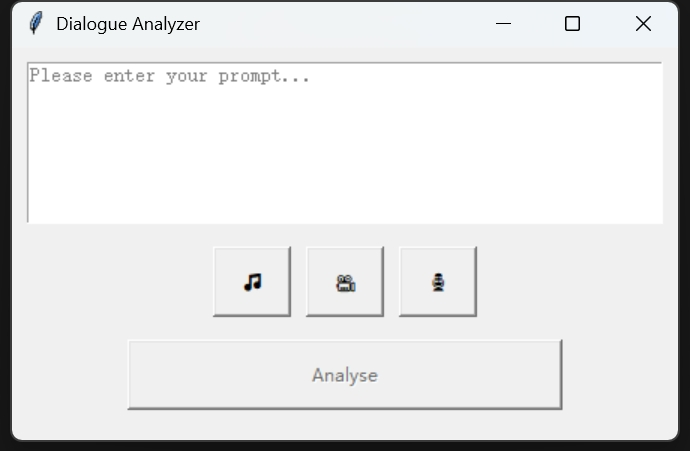
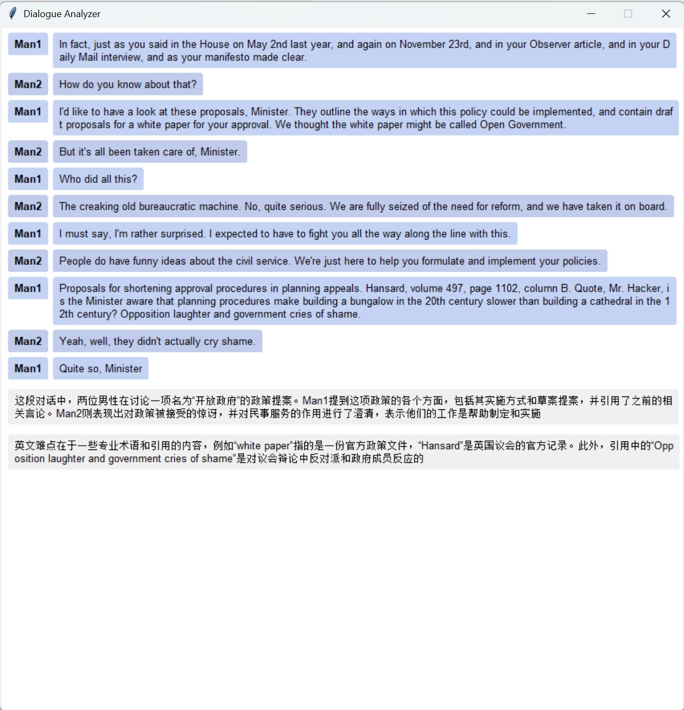

# Dialogue-Analyzer-of-TV-Series

## 一、 项目介绍
这是一款可以在本地传入英语音频或视频，传出文字对话框与中文分析的小型项目。基于大语言模型实现。

## 二、 部署方法

1. 下载项目到本地，在.env文件中填写自己的API Key。

2. 在终端里打开项目目录，并运行"python main.pyw"，弹出页面效果如图。

3. 中间的三个按钮的功能从左到右分别是传入音频，传入视频，录制系统音频；前两者点击后选择需要分析的文件即可，第三者点一下开始录制，点第二下结束录制。

4. 分析样例"dialogue.mp3"效果如图。

